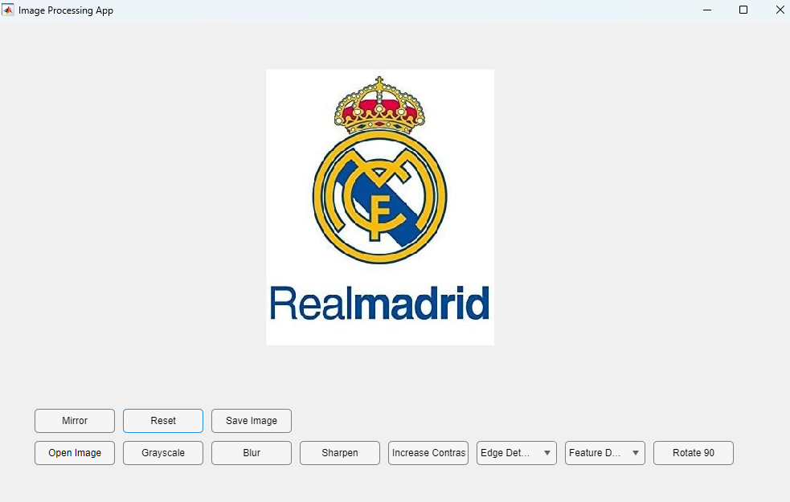

# ImageProcessingToolbox



This MATLAB-based GUI application allows users to perform various image processing operations interactively.

## Features

- **Open Image**: Load an image file (supports `.jpg` and `.png` formats).
- **Grayscale**: Convert the image to grayscale.
- **Blur**: Apply Gaussian blur to the image.
- **Sharpen**: Enhance image sharpness.
- **Increase Contrast**: Adjust image contrast interactively.
- **Edge Detection**: Detect edges using Sobel or Canny methods.
- **Feature Detection**: Detect keypoints using Harris corner detection or SIFT.
- **Rotate 90**: Rotate the image clockwise by 90 degrees.
- **Mirror**: Flip the image horizontally.
- **Reset**: Restore the image to its original state.
- **Save Image**: Save the processed image to a file.

## Requirements

- MATLAB R2019 or higher
- Image Processing Toolbox (for certain operations like edge detection and feature detection)

## Getting Started

1. Clone the repository:

   ```bash
   git clone https://github.com/kamalipurnet/ImageProcessingToolbox.git
3. Open MATLAB and navigate to the cloned directory
4. Run the ImageProcessingToolbox.m script in MATLAB

## Notes

This application is designed to demonstrate basic image processing techniques using MATLAB.
Certain operations (like feature detection with SIFT) are simplified and may not represent full implementations.

## Contributing

Contributions are welcome! If you have suggestions, feature requests, or bug reports, please open an issue or submit a pull request.